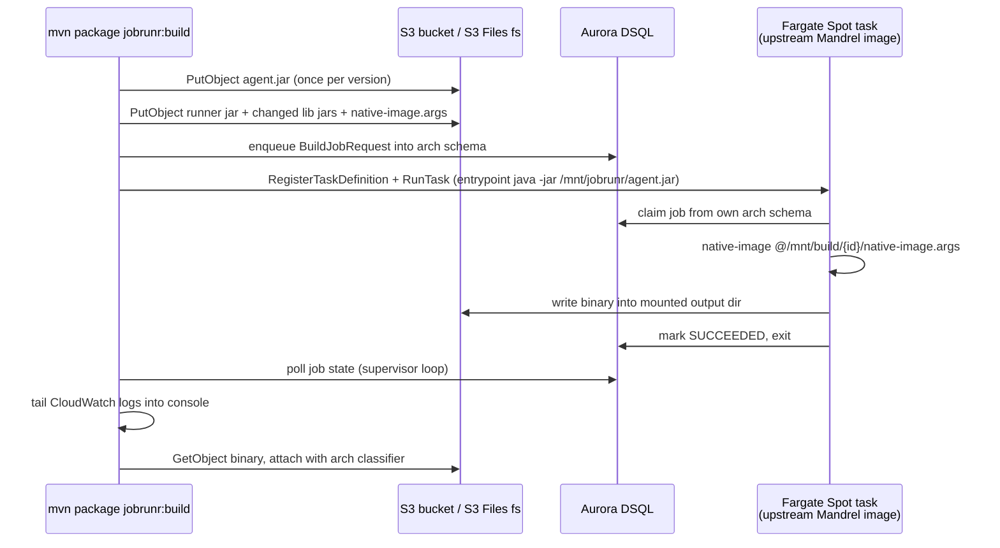

# Design: JobRunr Maven Plugin for Parallel GraalVM/Mandrel Builds on Fargate Spot

Status: accepted, implementation in progress
Last updated: 2026-09-01

## 1. Problem

GraalVM `native-image` cannot cross-compile. Producing both x86-64 and arm64 native
binaries therefore requires building on hardware of each architecture. Developer
machines have one architecture and limited RAM/cores, and `native-image` is one of the
most memory-hungry steps in a Java build.

This plugin makes a single `mvn` invocation stage a project's native-image build inputs
to S3, launch one AWS Fargate Spot task per requested architecture, run `native-image`
there in parallel, stream logs back, and attach the resulting binaries to the local
reactor. JobRunr supplies the durable job queue, retries and observability, so a Spot
interruption mid-build is recoverable rather than fatal.

## 2. Decisions

| # | Decision |
|---|---|
| 1 | **Topology**: ephemeral JobRunr `BackgroundJobServer` per Fargate task. The plugin enqueues to a shared database and calls `RunTask`; the task boots, claims its job, builds, exits. |
| 2 | **Transport**: the plugin writes inputs as S3 objects; the task sees them as files through an ECS **S3 Files** volume; the task writes the binary to the mount; the plugin reads only the binary back. |
| 3 | **Infrastructure ownership**: cluster, VPC/subnets, S3 bucket, S3 file system + mount target and IAM roles are pre-provisioned. The plugin registers **task definitions only**, derived from configuration on each run. |
| 4 | **Storage**: pluggable `storage.type` — `dsql` (default, Aurora DSQL), `postgres` (Aurora Serverless v2 fallback), `inmemory` (tests). A spike proves DSQL before we commit to it. |
| 5 | **Granularity**: one job per architecture; the job payload carries a reserved module selector so per-module fan-out can be added later without a schema or API change. |
| 6 | **UX**: `jobrunr:build` blocks, streams remote logs into the Maven console, fails the build on remote failure, and downloads artifacts at the end. |
| 7 | **No Maven and no custom image remotely**: use the upstream Quarkus/Red Hat **Mandrel** builder image unmodified, mount `agent.jar` through the S3 Files volume, and run `native-image @args` only. |
| 8 | **Input mode**: `native-sources`/derived-argfile by default. `.nib` bundle mode is an optional later addition. |

## 3. Verified research

Every constraint below was checked against primary sources rather than assumed.

### ECS S3 Files

[S3 Files for ECS](https://docs.aws.amazon.com/AmazonECS/latest/developerguide/s3files-volumes.html)
is GA on Fargate and ECS Managed Instances, and unsupported on the EC2 launch type. It
provides read/write file-system semantics over a bucket with files and objects kept
synchronised, and it mandates both transit encryption and a task IAM role. The task
definition takes an `s3filesVolumeConfiguration` with `fileSystemArn`
(`arn:aws:s3files:{region}:{account}:file-system/fs-xxxxx`), optional `rootDirectory`
and optional `accessPointArn`. A pre-provisioned S3 file system with a mount target
reachable from the task subnets is a prerequisite.

Consequence: because the mount is bidirectional and writable, the agent needs no S3 SDK
code at all. The plugin uses the ordinary S3 API on the same bucket.

### Mandrel builder image

[quarkusio/quarkus-images](https://github.com/quarkusio/quarkus-images) describes
`ubi-quarkus-mandrel-builder-image` / `ubi9-quarkus-mandrel-builder-image` as providing
the `native-image` executable from the Mandrel distribution. It ships a JDK but **not
Maven** — a separate third-party image exists purely to add Maven, which confirms the
absence. Their tooling publishes `-amd64` and `-arm64` variants plus a combined
multi-arch manifest. Mandrel deliberately omits GraalVM features (polyglot/Truffle,
`gu`), so the image must stay configurable; GraalVM CE builder images are the
alternative for projects needing those.

### Quarkus `native-sources`

The [`native-sources` package type](https://github.com/quarkusio/quarkus/issues/19460)
emits a runner jar plus a `native-image.args` file precisely so the native image can be
built in a separate step. The remote job is then literally
`native-image @native-image.args`.

**Important caveat discovered while inspecting a real consumer project**: the presence of
a `target/*-native-image-source-jar/` directory does *not* imply that `native-image.args`
exists. That directory is a byproduct of an ordinary native build; the args file is only
written by the `native-sources` packaging type. See §7.

### GraalVM bundles

[Native Image Bundles](https://www.graalvm.org/jdk25/reference-manual/native-image/overview/Bundles/)
(`--bundle-create[=x.nib][,dry-run]`, `--bundle-apply`) are documented as experimental,
require a local `native-image` to create, and record the creating platform/architecture
and native-image version in `META-INF/nibundle.properties`. Cross-architecture apply is
therefore a spike, not an assumption. Deferred.

### Fargate Spot on arm64

[Graviton-based Spot compute with Fargate](https://aws.amazon.com/about-aws/whats-new/2024/09/amazon-ecs-graviton-based-spot-compute-fargate)
has been supported since September 2024: `runtimePlatform: ARM64` combined with the
`FARGATE_SPOT` capacity provider.

### JobRunr storage model

Per the [storage documentation](https://www.jobrunr.io/en/documentation/storage/),
JobRunr creates `jobrunr_jobs`, `jobrunr_recurring_jobs`,
`jobrunr_backgroundjobservers`, `jobrunr_metadata`, `jobrunr_migrations`, plus
`jobrunr_jobs_stats` which is a **view**. It supports a **table prefix** (usable as a
schema qualifier), can emit its DDL through `DatabaseSqlMigrationFileProvider`, and can
run against externally created schema with `DatabaseOptions.SKIP_CREATE`. Job arguments
are serialised to JSON into the database, so payloads must stay small — no source trees
in job arguments. A CockroachDB provider exists and serves as the template for a
distributed-SQL variant.

API shape confirmed by inspecting `jobrunr-8.8.2.jar` directly:

- `BackgroundJobServer(StorageProvider, JsonMapper, JobActivator, BackgroundJobServerConfiguration)`
  is public, so both the plugin and the agent can avoid JobRunr's global static
  configuration. This matters for a plugin running inside a long-lived Maven JVM.
- `JobRequestScheduler(StorageProvider)` is public; `enqueue(JobRequest)` returns a `JobId`.
- `JobMapper(JsonMapper)` and `storageProvider.setJobMapper(...)` let us wire storage
  manually.
- `JacksonJsonMapper` lives at `org.jobrunr.utils.mapper.jackson.JacksonJsonMapper`.
- `Job.getState()` returns a `StateName`, which is what the supervisor polls.

### Architecture routing without JobRunr Pro

Server Tags — the natural way to pin a job to an arm64 worker — is a Pro feature.
Community workers can claim any enqueued job, so an arm64 task could steal an x86 job.

**Solution**: run two logically separate JobRunr clusters inside one database using the
table prefix as a schema qualifier (`jobrunr_x86_64.`, `jobrunr_arm64.`). Each ephemeral
worker connects only to its own architecture's schema. A cheap `os.arch` assertion at job
start catches misconfiguration.

**Consequence**: concurrent same-architecture builds may have their jobs work-stolen
between tasks. This is benign, but it means the plugin must wait on **job state in the
database**, never on a specific task ARN.

### Aurora DSQL constraints

From the [migration guide](https://docs.aws.amazon.com/aurora-dsql/latest/userguide/working-with-postgresql-compatibility-unsupported-features.html)
and [supported SQL](https://docs.aws.amazon.com/aurora-dsql/latest/userguide/working-with-postgresql-compatibility-supported-sql-features.html):

- `CREATE [UNIQUE] INDEX ASYNC` only — plain `CREATE INDEX` is rejected.
- DDL and DML require separate transactions, and one DDL statement per transaction.
- No PL/pgSQL. `CREATE VIEW` (permanent), sequences and foreign keys are supported.
- Isolation is fixed at Repeatable Read with optimistic concurrency control, so conflicts
  surface as serialization errors instead of lock waits.
- Connections time out after one hour.
- A transaction may modify at most 3,000 rows.

JobRunr's automatic DDL will therefore fail on DSQL. Mitigation: generate its scripts,
adapt them, apply out-of-band, and run with `SKIP_CREATE`; wrap the provider with a
retry on SQLSTATE `40001`; keep pool `maxLifetime` under one hour; and use the official
[Aurora DSQL JDBC connector](https://docs.aws.amazon.com/aurora-dsql/latest/userguide/SECTION_program-with-jdbc-connector.html)
(`software.amazon.dsql:aurora-dsql-jdbc-connector`) for short-lived IAM tokens.

DSQL's public IAM-authenticated endpoint is what makes laptop-invoked builds possible.
Aurora Serverless v2 is the fallback: fully compatible with JobRunr, scale-to-zero
capable, but VPC-only, which would force the plugin to run inside the VPC.

### Spot interruption semantics

Interruption delivers SIGTERM with a grace period. On graceful worker shutdown JobRunr
re-queues the job, and orphaned `PROCESSING` jobs from dead servers are rescheduled after
heartbeat timeout. The plugin needs a supervisor loop that relaunches a task when a job
returns to `ENQUEUED` with no live task.

### Fargate ceilings

16 vCPU, 120 GB memory, 20–200 GiB ephemeral storage. Because `native-image` is
memory-hungry, cpu/memory/ephemeral storage are first-class configuration.

[ECR pull-through cache](https://docs.aws.amazon.com/AmazonECR/latest/userguide/pull-through-cache.html)
supports quay.io, which is recommended for private subnets and pull reliability.

## 4. Architecture

What this removes compared with a conventional remote-build design: no custom builder
image, no ECR build-and-push cycle, no source tarball, no remote Maven invocation, no
remote `~/.m2`, and no S3 SDK inside the agent. What it adds: an S3 file system
prerequisite, an input-staging planner in the plugin, and an entrypoint override on an
upstream image.

## 5. Modules

| Module | Contents |
|---|---|
| `jobrunr-build-shared` | `Architecture`, `BuildJobRequest` (JobRunr `JobRequest`), `BuildJobRequestHandler`, `BuildExecutor` + `NativeImageBuildExecutor`, `WorkerRuntime`, `StagingLayout`, `StorageProviderFactory` (`dsql` / `postgres` / `inmemory`) with the DSQL provider, retry decorator and pooling. |
| `jobrunr-maven-plugin` | Goals `build`, `register-task-definitions`, `init-storage`; the input-staging planner; the supervisor loop; CloudWatch log tailing; artifact attachment. |
| `jobrunr-build-agent` | Container `main()`: read env config, start a single-worker `BackgroundJobServer` against its architecture's schema, process one job, exit. Idle-exit timeout; SIGTERM to graceful shutdown so the job re-queues. Compiled for Java 17 so it runs on the image's JDK 25. |

`WorkerRuntime` is shared deliberately: the plugin's local mode and the container agent
start the *same* worker code, so the container contract is exercised by ordinary unit
tests.

## 6. Security posture

- The invoking principal needs `ecs:RegisterTaskDefinition`, `ecs:RunTask`, and
  `iam:PassRole` for the task and execution roles, S3 read/write scoped to the build
  prefix, `dsql:DbConnect*`, and CloudWatch Logs read.
- `iam:PassRole` is the notable privilege for a build tool to hold. It will be documented
  with `ecs:cluster` and `iam:PassedToService` conditions rather than wildcards.
- S3 Files requires a task IAM role and always encrypts in transit.
- `init-storage` uses a DDL-capable database role distinct from the runtime role.
- Staged inputs are build outputs rather than a source tree, which reduces secret-leak
  surface, but bucket SSE-KMS and a short lifecycle expiry are still expected.

## 7. Input staging: three cases

Discovered while inspecting a real Quarkus consumer (`KubeECS`, Quarkus 3.37.1, pinned to
`quay.io/quarkus/ubi9-quarkus-mandrel-builder-image:jdk-25`): both
`operator-controller` and `operator-cli` have a `*-native-image-source-jar/` directory,
yet no `native-image.args` exists anywhere in the repository.

The planner therefore handles:

1. **Args present** — use `native-image.args` verbatim; stage the source-jar directory.
2. **Source-jar directory present, args absent** — fail fast naming the exact command
   (`mvn package -Dquarkus.package.jar.type=native-sources`), with an opt-in flag to run
   it automatically. Reconstructing Quarkus's arguments by hand is unsafe because
   extensions inject many `-H:` flags.
3. **Non-Quarkus** — derive the argfile from the resolved runtime classpath plus
   `native-maven-plugin` configuration (main class, image name, `buildArgs`).

Argument files and `-cp` entries are written **relative to the staging root**, and
`native-image` is invoked with the staging root as its working directory. The same argfile
therefore works unchanged locally and inside the container.

### Why content-hash dedup matters

Measured on that consumer: the staged payload is 52 MB for `operator-controller` and
44 MB for `operator-cli`, almost entirely `lib/` (232 jars that rarely change). First
upload is ~52 MB; steady state is the ~1 MB runner jar plus the args file. Dedup is what
makes this feel low-friction, so it stays in the first S3 task rather than being deferred.

## 8. Dependency versions

Pinned and verified resolvable against Maven Central:

| Dependency | Version |
|---|---|
| `org.jobrunr:jobrunr` | 8.8.2 |
| `software.amazon.awssdk:bom` | 2.36.0 |
| `software.amazon.dsql:aurora-dsql-jdbc-connector` | 1.1.0 |
| `org.postgresql:postgresql` | 42.7.7 |
| `com.zaxxer:HikariCP` | 6.3.0 |
| `com.fasterxml.jackson:jackson-bom` | 2.20.0 |
| `org.slf4j:slf4j-api` / `slf4j-simple` | 2.0.17 |
| `org.junit:junit-bom` | 5.14.0 |
| `org.mockito:mockito-core` | 5.23.0 |
| `org.testcontainers:postgresql` | 1.21.3 |
| Maven API | 3.9.10 |

Java release level is 17 for all modules. The plugin and agent bytecode runs fine on the
Mandrel image's JDK 25, while remaining usable from older Maven JVMs.

## 9. Task breakdown

1. **Skeleton, job contract, local vertical slice.** Four modules; `BuildJobRequest` with
   architecture and reserved module selector; staging planner covering the three cases in
   §7; `NativeImageBuildExecutor`; in-memory storage with an in-process worker.
   *Demo*: `mvn package jobrunr:build -Djobrunr.storage=inmemory -Djobrunr.executor=local`
   builds through a real JobRunr job with no AWS.
2. **DSQL storage provider, per-architecture schemas, `init-storage`** — the go/no-go
   gate. Adapted DDL, `SKIP_CREATE`, DSQL JDBC connector, retry decorator, pool lifetime
   under the one-hour cap. Testcontainers Postgres always-on; opt-in `-Pdsql-it` against
   a real cluster. Failure mode is the documented Aurora Serverless v2 fallback.
3. **S3 staging and artifact retrieval.** Content-hash dedup, versioned `agent.jar` key,
   binary retrieval, `attachArtifact` with an architecture classifier.
4. **Agent on the unmodified Mandrel image.** Entrypoint override, non-root user,
   `native-image` temp on ephemeral storage with only the binary on the mount, SIGTERM
   handling, `os.arch` assertion, idle-exit. Validated locally with a bind mount standing
   in for S3 Files, using the already-cached Mandrel jdk-25 image.
5. **Task definition registration** including `s3filesVolumeConfiguration`,
   `runtimePlatform`, sizing, `awslogs`, roles, and optional ECR pull-through-cache image
   reference. Idempotent: no new revision when unchanged.
6. **Fargate Spot launch, supervisor loop, log streaming** (single architecture).
   Relaunch on re-queue, on-demand fallback after N interruptions, `StopTask` on timeout,
   remote failure fails the Maven build.
7. **Both architectures in parallel.** Aggregated per-architecture summary, fail-fast vs
   collect-all, partial-success reconciliation, orphan and staging cleanup.
8. **Hardening, documentation, bootstrap infrastructure.** Least-privilege IAM,
   SSE-KMS/lifecycle guidance, private-subnet networking notes, job retention tuned under
   DSQL's row cap, README and `AGENTS.md`, optional CloudFormation/CDK bootstrap.
9. **Optional**: `.nib` bundle input mode, gated on a cross-architecture apply spike.

### Sequencing notes

- Task 2 is the primary risk and is deliberately early; its failure mode is a documented
  fallback, not a redesign.
- Task 4 precedes Tasks 5 and 6 so the container contract is proven locally before any
  ECS involvement.
- The plugin always waits on job state in the database, never on a task ARN, because
  same-architecture work stealing is expected and benign.
