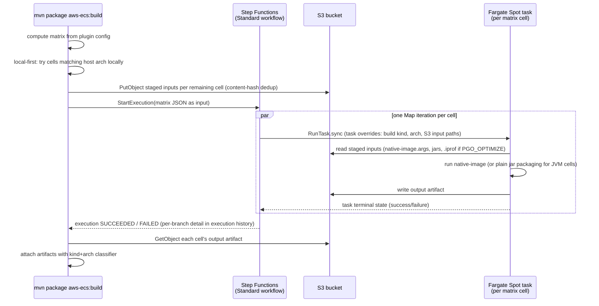
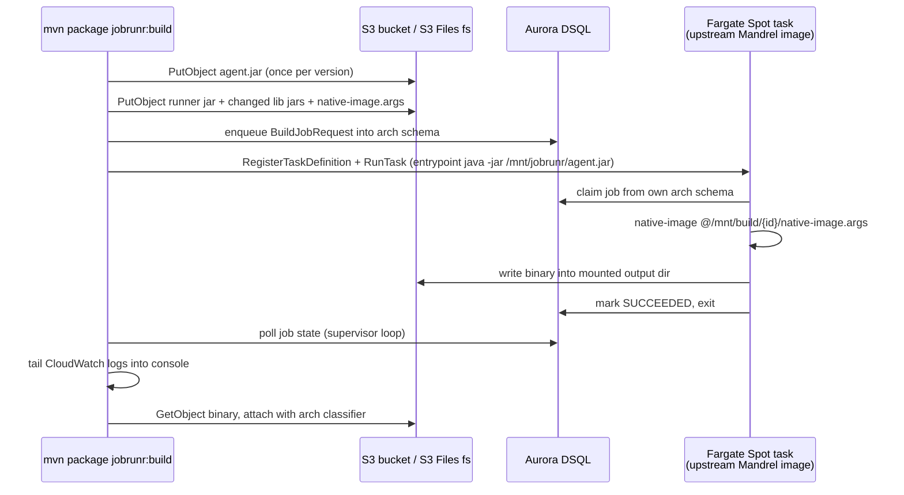

# Design: Maven Plugin for Parallel GraalVM/Mandrel Build Matrices on Fargate Spot

Status: revised, supersedes the JobRunr/Aurora DSQL design below (§10)
Last updated: 2026-09-03

## 1. Problem

GraalVM `native-image` cannot cross-compile. A project that wants to ship both x86-64
and arm64 native binaries — and, for either architecture, plain JVM jars, profile-guided
instrumented binaries, and profile-guided optimized binaries — needs a **build matrix**,
the same shape GitHub Actions' `strategy.matrix` describes: a known, finite set of
independent build cells computed once per invocation, each running on its own worker,
none stealing another cell's work.

This plugin makes a single `mvn` invocation compute that matrix, stage each cell's build
inputs to S3, fan out one AWS Fargate Spot task per cell via AWS Step Functions, run
`native-image` there in parallel, stream logs back, and attach the resulting artifacts to
the local reactor with an architecture/kind classifier — the same practical outcome as a
CI build matrix, but triggered from a developer's own `mvn package` rather than requiring
a CI provider or self-hosted ARM runners.

## 2. Why Step Functions, not a job queue

An earlier revision of this design used JobRunr (a Java background-job library) backed
by Aurora DSQL as the coordination layer between the plugin and the ephemeral build
tasks. That approach is preserved in §10 for the record, but is **not carried forward**,
for a reason specific to this workload's shape rather than a general judgment on
JobRunr:

JobRunr's core value is a **shared queue with optimistic-locking claim semantics** —
useful when an unknown number of workers pull from an unbounded backlog and you need to
guarantee no two workers claim the same item. This plugin's workload is the opposite
shape: the matrix is fully known and enumerable the moment `BuildMojo` computes it, every
cell is independent by construction (a cell for `arm64`/`NATIVE` never should, and
structurally cannot, pick up `x86_64`/`NATIVE_PGO_OPTIMIZE`'s work — `native-image` can't
cross-compile), and the plugin always launches exactly one task per cell. There is no
work-stealing to protect against and no queue depth to react to.

AWS Step Functions' **Map state** matches that shape directly: it accepts a JSON array
(the computed matrix) and runs one child workflow per element, each calling
`arn:aws:states:::ecs:runTask.sync` — a native integration that launches the task and
blocks until it reaches a terminal state, surfacing success or failure without any
polling code. `Retry`/`Catch` on that state express Spot-interruption handling
declaratively. None of this requires a database: Step Functions tracks execution state
itself. Dropping JobRunr and Aurora DSQL removes an entire storage tier — no schema, no
DDL, no connection pool, no cross-region/one-hour-connection-lifetime constraints — from
a design that never needed a queue in the first place.

The design doc's original "work stealing is benign" invariant, quoted below for
historical accuracy, described a solution to a problem this workload's actual shape does
not have:

> Concurrent same-architecture builds may have their jobs work-stolen between tasks.
> This is benign, but it means the plugin must wait on job state in the database, never
> on a specific task ARN.

Under the matrix model there is exactly one task per cell, so this concern does not
arise, and the mechanism built to tolerate it (JobRunr's job-state polling and
`BuildSupervisor`'s relaunch loop) is replaced by `RunTask.sync` plus a `Retry` policy.

## 3. The build matrix

**Axis 1 — build kind:**

| Kind | Needs architecture? | Extra input | Notes |
|---|---|---|---|
| `JVM` | no | — | plain jar; bytecode is portable, no `native-image` involved |
| `NATIVE` | yes | — | plain `native-image` build |
| `NATIVE_PGO_INSTRUMENT` | yes | — | `native-image --pgo-instrument`; output is an instrumented binary. **This plugin's responsibility ends at producing that binary.** Running it against a representative workload to collect a `.iprof` profile — whether that happens via a canary deploy, a blue/green rollout, or a manual load test — is explicitly out of scope. |
| `NATIVE_PGO_OPTIMIZE` | yes | a `.iprof` file, supplied by the caller | `native-image --pgo=profile.iprof`; the profile is staged through the same content-hash S3 path already used for build inputs — no new mechanism needed |

**Axis 2 — architecture** (applies to every kind except `JVM`): `x86_64`, `arm64`.

Full cell set: `JVM` (1 cell) + 3 native-ish kinds × 2 architectures (6 cells) = **7
possible cells**. A given Maven invocation selects a subset via plugin configuration —
the same relationship a GitHub Actions job has to its matrix's `include`/`exclude`, not
every cell runs on every invocation.

**Local-first short-circuit.** This is a per-cell control-flow decision in `BuildMojo`,
not an 8th matrix value. If the invoking machine's architecture matches a cell's target
and the `native-image` toolchain is available locally, `BuildMojo` attempts that cell
locally and only falls back to launching a Step Functions execution branch for it if
local execution isn't possible or fails. Because this decision is made before any
orchestration begins, it needs no shared abstraction across local and remote execution —
a direct call to the existing `NativeImageBuildExecutor` suffices.

**PGO is not a pipeline this plugin orchestrates.** `NATIVE_PGO_INSTRUMENT` and
`NATIVE_PGO_OPTIMIZE` are two independent, separately-triggerable cells, not a chained
three-step workflow. There is no "profiling run" state, no automatic hand-off between
them inside a single execution. A team collecting a fresh profile requests an
`NATIVE_PGO_INSTRUMENT` build, runs the resulting binary however they run production
traffic against it (outside this tool), and later requests an `NATIVE_PGO_OPTIMIZE`
build pointing at the `.iprof` that process produced.

## 4. Architecture



What this removes compared with the JobRunr-based design: Aurora DSQL (and its schema,
DDL adaptation, connection-lifetime constraints), `WorkerRuntime`, `BuildJobRequestHandler`'s
queue-claiming dispatch, `BuildSupervisor`'s hand-rolled polling/relaunch loop, and
JobRunr itself as a dependency in both the plugin and the agent. What stays: the S3
content-hash staging design (§7 of the historical section, unchanged), the Mandrel
builder image and its non-root/uid-1001 constraints, and `TaskDefinitionRegistrar`'s
idempotent-registration approach — now registering one task definition per (build kind,
architecture) combination instead of per architecture alone.

## 5. Step Functions state machine shape

One **Standard** workflow (not Express — Express caps execution at 5 minutes; native
image builds routinely exceed that). Sketch, JSONata-flavored ASL, using `Overrides` as
confirmed against the current `ecs:runTask.sync` integration reference:

```json
{
  "StartAt": "BuildMatrix",
  "States": {
    "BuildMatrix": {
      "Type": "Map",
      "ItemsPath": "$.cells",
      "MaxConcurrency": 7,
      "ItemProcessor": {
        "ProcessorConfig": { "Mode": "INLINE" },
        "StartAt": "RunCell",
        "States": {
          "RunCell": {
            "Type": "Task",
            "Resource": "arn:aws:states:::ecs:runTask.sync",
            "Arguments": {
              "Cluster": "",
              "TaskDefinition": "",
              "CapacityProviderStrategy": [
                { "CapacityProvider": "FARGATE_SPOT", "Weight": 4, "Base": 1 },
                { "CapacityProvider": "FARGATE", "Weight": 1, "Base": 0 }
              ],
              "Overrides": {
                "ContainerOverrides": [{
                  "Name": "agent",
                  "Environment": [
                    { "Name": "BUILD_KIND", "Value": "" },
                    { "Name": "BUILD_ARCH", "Value": "" },
                    { "Name": "S3_INPUT_PREFIX", "Value": "" },
                    { "Name": "S3_OUTPUT_PREFIX", "Value": "" }
                  ]
                }]
              }
            },
            "Retry": [{
              "ErrorEquals": ["States.TaskFailed"],
              "MaxAttempts": 2,
              "BackoffRate": 2.0,
              "IntervalSeconds": 5
            }],
            "Catch": [{
              "ErrorEquals": ["States.ALL"],
              "ResultPath": "$.error",
              "Next": "RecordCellFailure"
            }],
            "End": true
          },
          "RecordCellFailure": {
            "Type": "Pass",
            "Comment": "Inline Map has no ToleratedFailurePercentage (that's Distributed-Map-only, confirmed against the docs). Catching per-branch and passing the failure through as data, instead of letting it propagate, is what gives an Inline Map fail-fast:false-equivalent -- the Map as a whole still succeeds, and the plugin inspects each branch's recorded outcome afterward.",
            "End": true
          }
        }
      },
      "End": true
    }
  }
}
```

**Correction to an assumption worth stating plainly**: `ToleratedFailureCount` and
`ToleratedFailurePercentage` are **Distributed Map** features only, confirmed against
the Step Functions developer guide — Inline Map (the mode this workload needs; 7 cells
is nowhere near the 40-way concurrency ceiling that would justify Distributed mode's
extra complexity) fails the entire Map on the first uncaught iteration failure. GitHub
Actions' `fail-fast: false` equivalent is achieved here by wrapping each cell's
`RunTask.sync` in a `Catch` that redirects to a pass-through failure-recording state
instead of letting the error propagate — the Map state itself always "succeeds"; the
plugin reads each branch's recorded per-cell outcome from the execution output afterward
and decides whether to fail the Maven build. `fail-fast: true` (GitHub's default) is the
uncaught-propagation behavior Inline Map already has out of the box — no `Catch` needed
if that's the desired behavior for a given invocation.

## 6. Components

| Module | Contents |
|---|---|
| `jobrunr-build-shared` → renamed/repurposed | `Architecture`, `BuildKind` (new: `JVM`/`NATIVE`/`NATIVE_PGO_INSTRUMENT`/`NATIVE_PGO_OPTIMIZE`), `BuildExecutor`/`NativeImageBuildExecutor` (extended with `--pgo-instrument`/`--pgo=` flag support), `StagingLayout`. JobRunr, `WorkerRuntime`, `StorageProviderFactory`, and the DSQL layer are removed. |
| `jobrunr-maven-plugin` → the orchestration owner | matrix computation from plugin config, local-first short-circuit, S3 staging (unchanged from the prior design), `TaskDefinitionRegistrar` (extended to key task definitions by build-kind+architecture), a new `StateMachineManager` (analogous role to `TaskDefinitionRegistrar`: generate/deploy/describe the Step Functions state machine idempotently, tagged with a config hash the same way task definitions are), `StepFunctionsExecutionSupervisor` (`StartExecution`, poll `DescribeExecution`, parse per-cell outcomes from the Map's output), artifact attachment with kind+arch classifiers. |
| `jobrunr-build-agent` → simplified | reads `BUILD_KIND`/`BUILD_ARCH`/`S3_INPUT_PREFIX`/`S3_OUTPUT_PREFIX` env vars (task overrides, not a job payload), runs the corresponding build step once, writes output, exits. No polling loop, no worker runtime, no queue-claiming — the container's entire job is "do the one thing this task override says, then stop." |

## 7. Security posture

Unchanged in kind from the prior design, updated for the removed/added surface area:

- Removed: `dsql:DbConnect*`, DDL-capable database role for schema setup.
- Added: `states:StartExecution`, `states:DescribeExecution` (plugin, to run and observe
  the workflow); the Step Functions execution role needs `ecs:RunTask`, `ecs:StopTask`,
  `ecs:DescribeTasks`, and `iam:PassRole` for the task/execution roles it launches on the
  plugin's behalf (this moves `iam:PassRole` from the invoking principal to the state
  machine's own execution role, which is narrower — the plugin's principal no longer
  needs it directly).
- Unchanged: S3 read/write scoped to the build prefix, CloudWatch Logs read for log
  tailing, S3 Files' mandatory transit encryption and task IAM role requirement.

## 8. Task breakdown (supersedes the prior §9)

1. **Matrix model and local-first short-circuit.** `BuildKind` enum, matrix computation
   from plugin configuration (mirroring GitHub's `include`/`exclude` semantics), the
   per-cell local-execution check in `BuildMojo`. *Demo*: a matrix with only
   locally-satisfiable cells builds end-to-end with zero AWS calls.
2. **`NativeImageBuildExecutor` PGO support.** `--pgo-instrument` for
   `NATIVE_PGO_INSTRUMENT`, `--pgo={path}` for `NATIVE_PGO_OPTIMIZE` given a staged
   `.iprof`. Unit-tested with a fake `native-image` script asserting the right flags per
   build kind.
3. **Task definition registration per (build kind, architecture).** Extends the existing
   idempotent `TaskDefinitionRegistrar` (config-hash tag, unchanged mechanism) to key
   families by build kind as well as architecture, since a `NATIVE_PGO_OPTIMIZE` task
   needs a different input contract (the `.iprof` env var) than a plain `NATIVE` one.
4. **`StateMachineManager`.** Generate the ASL definition from §5, deploy/update it
   idempotently (same config-hash-tag pattern as task definitions), describe it for the
   plugin to discover the state machine ARN to invoke.
5. **`StepFunctionsExecutionSupervisor`.** `StartExecution` with the computed matrix as
   input, poll `DescribeExecution`, parse the Map's per-cell output (including any
   `RecordCellFailure` entries), decide overall success/failure per the invocation's
   fail-fast configuration, fail the Maven build on remote failure.
6. **Agent simplification.** Replace the JobRunr-worker entrypoint with a direct
   read-env-vars-run-once-exit entrypoint. Removes `WorkerRuntime` and
   `BuildJobRequestHandler`'s dispatch from the agent's runtime dependencies entirely.
7. **Hardening, documentation, bootstrap infrastructure.** Least-privilege IAM for the
   narrowed `iam:PassRole` surface (§7), SSE-KMS/lifecycle guidance for staged S3
   objects (unchanged), README and `AGENTS.md` updates reflecting the new architecture,
   optional CloudFormation/CDK bootstrap for the state machine + task definitions.
8. **Optional, unchanged from prior design**: `.nib` bundle input mode.

Tasks 1–4 of the prior JobRunr-based breakdown (skeleton/local-slice, DSQL storage,
S3 staging, Mandrel agent wiring) are **not discarded work** — the S3 staging layer
(Task 3) and the Mandrel container wiring (Task 4, minus its JobRunr worker entrypoint)
carry forward unchanged into this design. The DSQL storage layer (Task 2) and the
ECS/Fargate launch-and-supervise code (Tasks 5–6, `TaskDefinitionRegistrar` partially,
`FargateTaskLauncher`/`BuildSupervisor`/`CloudWatchLogTailer` fully) are superseded by
§5's state machine and `StepFunctionsExecutionSupervisor` respectively.

## 9. Open questions / not yet validated against live AWS

- No Step Functions state machine, ECS cluster, VPC, or S3 Files filesystem has been
  provisioned. None of §5's ASL has run against real AWS.
- The exact per-cell task-override contract (env var names) needs to be finalized
  against the simplified agent entrypoint from Task 6 before `StateMachineManager` can
  generate a definition that will actually work.
- Whether `NATIVE_PGO_OPTIMIZE`'s `.iprof` should be a required plugin-configuration
  input (a fixed S3 path/local file the user points at) or resolvable some other way
  (e.g., "latest profile for this artifact") is unresolved — the current assumption is
  the simplest one: the user supplies a path, staged like any other input.

---

## 10. Historical: the JobRunr/Aurora DSQL design (superseded)

Preserved verbatim below for anyone auditing why the DSQL storage layer, `WorkerRuntime`,
and the ECS supervisor code existed, and because the underlying research in §§3, 7, and
8 below (S3 Files mechanics, Mandrel image behavior, Fargate ceilings, dependency
versions) remains accurate and was reused rather than re-derived for the design above.

### 10.1 Original problem framing

This plugin makes a single `mvn` invocation stage a project's native-image build inputs
to S3, launch one AWS Fargate Spot task per requested architecture, run `native-image`
there in parallel, stream logs back, and attach the resulting binaries to the local
reactor. JobRunr supplies the durable job queue, retries and observability, so a Spot
interruption mid-build is recoverable rather than fatal.

### 10.2 Decisions

| # | Decision |
|---|---|
| 1 | **Topology**: ephemeral JobRunr `BackgroundJobServer` per Fargate task. The plugin enqueues to a shared database and calls `RunTask`; the task boots, claims its job, builds, exits. |
| 2 | **Transport**: the plugin writes inputs as S3 objects; the task sees them as files through an ECS **S3 Files** volume; the task writes the binary to the mount; the plugin reads only the binary back. |
| 3 | **Infrastructure ownership**: cluster, VPC/subnets, S3 bucket, S3 file system + mount target and IAM roles are pre-provisioned. The plugin registers **task definitions only**, derived from configuration on each run. |
| 4 | **Storage**: pluggable `storage.type` — `dsql` (default, Aurora DSQL), `postgres` (Aurora Serverless v2 fallback), `inmemory` (tests). A spike proves DSQL before we commit to it. |
| 5 | **Granularity**: one job per architecture; the job payload carries a reserved module selector so per-module fan-out can be added later without a schema or API change. |
| 6 | **UX**: `jobrunr:build` blocks, streams remote logs into the Maven console, fails the build on remote failure, and downloads artifacts at the end. |
| 7 | **No Maven and no custom image remotely**: use the upstream Quarkus/Red Hat **Mandrel** builder image unmodified, mount `agent.jar` through the S3 Files volume, and run `native-image @args` only. |
| 8 | **Input mode**: `native-sources`/derived-argfile by default. `.nib` bundle mode is an optional later addition. |

### 10.3 Verified research

Every constraint below was checked against primary sources rather than assumed.

#### ECS S3 Files

[S3 Files for ECS](https://docs.aws.amazon.com/AmazonECS/latest/developerguide/s3files-volumes.html)
is GA on Fargate and ECS Managed Instances, and unsupported on the EC2 launch type. It
provides read/write file-system semantics over a bucket with files and objects kept
synchronised, and it mandates both transit encryption and a task IAM role. The task
definition takes an `s3filesVolumeConfiguration` with `fileSystemArn`
(`arn:aws:s3files:{region}:{account}:file-system/fs-xxxxx`), optional `rootDirectory`
and optional `accessPointArn`. A pre-provisioned S3 file system with a mount target
reachable from the task subnets is a prerequisite.

Consequence: because the mount is bidirectional and writable, the agent needs no S3 SDK
code at all. The plugin uses the ordinary S3 API on the same bucket.

#### Mandrel builder image

[quarkusio/quarkus-images](https://github.com/quarkusio/quarkus-images) describes
`ubi-quarkus-mandrel-builder-image` / `ubi9-quarkus-mandrel-builder-image` as providing
the `native-image` executable from the Mandrel distribution. It ships a JDK but **not
Maven** — a separate third-party image exists purely to add Maven, which confirms the
absence. Their tooling publishes `-amd64` and `-arm64` variants plus a combined
multi-arch manifest. Mandrel deliberately omits GraalVM features (polyglot/Truffle,
`gu`), so the image must stay configurable; GraalVM CE builder images are the
alternative for projects needing those.

#### Quarkus `native-sources`

The [`native-sources` package type](https://github.com/quarkusio/quarkus/issues/19460)
emits a runner jar plus a `native-image.args` file precisely so the native image can be
built in a separate step. The remote job is then literally
`native-image @native-image.args`.

**Important caveat discovered while inspecting a real consumer project**: the presence of
a `target/*-native-image-source-jar/` directory does *not* imply that `native-image.args`
exists. That directory is a byproduct of an ordinary native build; the args file is only
written by the `native-sources` packaging type. See §10.6.

#### GraalVM bundles

[Native Image Bundles](https://www.graalvm.org/jdk25/reference-manual/native-image/overview/Bundles/)
(`--bundle-create[=x.nib][,dry-run]`, `--bundle-apply`) are documented as experimental,
require a local `native-image` to create, and record the creating platform/architecture
and native-image version in `META-INF/nibundle.properties`. Cross-architecture apply is
therefore a spike, not an assumption. Deferred.

#### Fargate Spot on arm64

[Graviton-based Spot compute with Fargate](https://aws.amazon.com/about-aws/whats-new/2024/09/amazon-ecs-graviton-based-spot-compute-fargate)
has been supported since September 2024: `runtimePlatform: ARM64` combined with the
`FARGATE_SPOT` capacity provider.

#### JobRunr storage model

Per the [storage documentation](https://www.jobrunr.io/en/documentation/storage/),
JobRunr creates `jobrunr_jobs`, `jobrunr_recurring_jobs`,
`jobrunr_backgroundjobservers`, `jobrunr_metadata`, `jobrunr_migrations`, plus
`jobrunr_jobs_stats` which is a **view**. It supports a **table prefix** (usable as a
schema qualifier), can emit its DDL through `DatabaseSqlMigrationFileProvider`, and can
run against externally created schema with `DatabaseOptions.SKIP_CREATE`. Job arguments
are serialised to JSON into the database, so payloads must stay small — no source trees
in job arguments. A CockroachDB provider exists and serves as the template for a
distributed-SQL variant.

API shape confirmed by inspecting `jobrunr-8.8.2.jar` directly:

- `BackgroundJobServer(StorageProvider, JsonMapper, JobActivator, BackgroundJobServerConfiguration)`
  is public, so both the plugin and the agent can avoid JobRunr's global static
  configuration. This matters for a plugin running inside a long-lived Maven JVM.
- `JobRequestScheduler(StorageProvider)` is public; `enqueue(JobRequest)` returns a `JobId`.
- `JobMapper(JsonMapper)` and `storageProvider.setJobMapper(...)` let us wire storage
  manually.
- `JacksonJsonMapper` lives at `org.jobrunr.utils.mapper.jackson.JacksonJsonMapper`.
- `Job.getState()` returns a `StateName`, which is what the supervisor polls.
- `Job.startProcessingOn(BackgroundJobServer)` performs the `ENQUEUED → PROCESSING`
  transition; `Job.updateProcessing()` does **not** — it only refreshes an
  already-`PROCESSING` job's timestamp, confirmed the hard way when a test that called
  the latter from `ENQUEUED` threw a `ClassCastException` on a background thread.
- The job state machine (`AllowedJobStateStateChanges`, confirmed via bytecode) does not
  allow `PROCESSING → ENQUEUED` directly — `Job.enqueue()` throws
  `IllegalJobStateChangeException` from `PROCESSING`. The legal re-queue path is
  `PROCESSING → FAILED → ENQUEUED`, mirroring JobRunr's own retry filter.

#### Architecture routing without JobRunr Pro

Server Tags — the natural way to pin a job to an arm64 worker — is a Pro feature.
Community workers can claim any enqueued job, so an arm64 task could steal an x86 job.

**Solution**: run two logically separate JobRunr clusters inside one database using the
table prefix as a schema qualifier (`jobrunr_x86_64.`, `jobrunr_arm64.`). Each ephemeral
worker connects only to its own architecture's schema. A cheap `os.arch` assertion at job
start catches misconfiguration.

**Consequence**: concurrent same-architecture builds may have their jobs work-stolen
between tasks. This is benign, but it means the plugin must wait on **job state in the
database**, never on a specific task ARN.

*(Superseded: the matrix model in §3 above has exactly one task per cell by
construction, so this concern, and the mechanism built to tolerate it, no longer apply.)*

#### Aurora DSQL constraints

From the [migration guide](https://docs.aws.amazon.com/aurora-dsql/latest/userguide/working-with-postgresql-compatibility-unsupported-features.html)
and [supported SQL](https://docs.aws.amazon.com/aurora-dsql/latest/userguide/working-with-postgresql-compatibility-supported-sql-features.html):

- `CREATE [UNIQUE] INDEX ASYNC` only — plain `CREATE INDEX` is rejected.
- DDL and DML require separate transactions, and one DDL statement per transaction.
- No PL/pgSQL. `CREATE VIEW` (permanent), sequences and foreign keys are supported.
- Isolation is fixed at Repeatable Read with optimistic concurrency control, so conflicts
  surface as serialization errors instead of lock waits.
- Connections time out after one hour.
- A transaction may modify at most 3,000 rows.

JobRunr's automatic DDL will therefore fail on DSQL. Mitigation: generate its scripts,
adapt them, apply out-of-band, and run with `SKIP_CREATE`; wrap the provider with a
retry on SQLSTATE `40001`; keep pool `maxLifetime` under one hour; and use the official
[Aurora DSQL JDBC connector](https://docs.aws.amazon.com/aurora-dsql/latest/userguide/SECTION_program-with-jdbc-connector.html)
(`software.amazon.dsql:aurora-dsql-jdbc-connector`) for short-lived IAM tokens.

DSQL's public IAM-authenticated endpoint is what makes laptop-invoked builds possible.
Aurora Serverless v2 is the fallback: fully compatible with JobRunr, scale-to-zero
capable, but VPC-only, which would force the plugin to run inside the VPC.

#### Spot interruption semantics

Interruption delivers SIGTERM with a grace period. On graceful worker shutdown JobRunr
re-queues the job, and orphaned `PROCESSING` jobs from dead servers are rescheduled after
heartbeat timeout. The plugin needs a supervisor loop that relaunches a task when a job
returns to `ENQUEUED` with no live task.

*(Superseded: §5's `Retry` on the `RunTask.sync` state expresses this declaratively.)*

#### Fargate ceilings

16 vCPU, 120 GB memory, 20–200 GiB ephemeral storage. Because `native-image` is
memory-hungry, cpu/memory/ephemeral storage are first-class configuration.

[ECR pull-through cache](https://docs.aws.amazon.com/AmazonECR/latest/userguide/pull-through-cache.html)
supports quay.io, which is recommended for private subnets and pull reliability.

### 10.4 Original architecture diagram



### 10.5 Original modules

| Module | Contents |
|---|---|
| `jobrunr-build-shared` | `Architecture`, `BuildJobRequest` (JobRunr `JobRequest`), `BuildJobRequestHandler`, `BuildExecutor` + `NativeImageBuildExecutor`, `WorkerRuntime`, `StagingLayout`, `StorageProviderFactory` (`dsql` / `postgres` / `inmemory`) with the DSQL provider, retry decorator and pooling. |
| `jobrunr-maven-plugin` | Goals `build`, `register-task-definitions`, `init-storage`; the input-staging planner; the supervisor loop; CloudWatch log tailing; artifact attachment. |
| `jobrunr-build-agent` | Container `main()`: read env config, start a single-worker `BackgroundJobServer` against its architecture's schema, process one job, exit. Idle-exit timeout; SIGTERM to graceful shutdown so the job re-queues. Compiled for Java 17 so it runs on the image's JDK 25. |

### 10.6 Input staging: three cases

Discovered while inspecting a real Quarkus consumer (`KubeECS`, Quarkus 3.37.1, pinned to
`quay.io/quarkus/ubi9-quarkus-mandrel-builder-image:jdk-25`): both
`operator-controller` and `operator-cli` have a `*-native-image-source-jar/` directory,
yet no `native-image.args` exists anywhere in the repository.

The planner therefore handles:

1. **Args present** — use `native-image.args` verbatim; stage the source-jar directory.
2. **Source-jar directory present, args absent** — fail fast naming the exact command
   (`mvn package -Dquarkus.package.jar.type=native-sources`), with an opt-in flag to run
   it automatically. Reconstructing Quarkus's arguments by hand is unsafe because
   extensions inject many `-H:` flags.
3. **Non-Quarkus** — derive the argfile from the resolved runtime classpath plus
   `native-maven-plugin` configuration (main class, image name, `buildArgs`).

Argument files and `-cp` entries are written **relative to the staging root**, and
`native-image` is invoked with the staging root as its working directory. The same argfile
therefore works unchanged locally and inside the container.

**This staging design is unchanged and fully reused in the current design (§4, §6).**

#### Why content-hash dedup matters

Measured on that consumer: the staged payload is 52 MB for `operator-controller` and
44 MB for `operator-cli`, almost entirely `lib/` (232 jars that rarely change). First
upload is ~52 MB; steady state is the ~1 MB runner jar plus the args file. Dedup is what
makes this feel low-friction, so it stays in the first S3 task rather than being deferred.

### 10.7 Dependency versions (JobRunr-era; not carried forward for the removed deps)

| Dependency | Version |
|---|---|
| `org.jobrunr:jobrunr` | 8.8.2 (removed in the current design) |
| `software.amazon.awssdk:bom` | 2.54.10 |
| `software.amazon.dsql:aurora-dsql-jdbc-connector` | 1.4.0 (removed) |
| `org.postgresql:postgresql` | 42.7.7 (removed) |
| `com.zaxxer:HikariCP` | 7.1.0 (removed) |
| `com.fasterxml.jackson:jackson-bom` | 2.20.0 |
| `org.slf4j:slf4j-api` / `slf4j-simple` | 2.0.17 |
| `org.junit:junit-bom` | 5.14.0 |
| `org.mockito:mockito-core` | 5.23.0 |
| `org.testcontainers:*` | 2.0.5 |
| Maven API | 3.9.10 |

Java release level is 17 for all modules. The plugin and agent bytecode runs fine on the
Mandrel image's JDK 25, while remaining usable from older Maven JVMs.

### 10.8 Original task breakdown, for cross-reference with §8's replacement

1. Skeleton, job contract, local vertical slice — **carried forward** as §8 Task 1 (matrix
   model replaces the job-contract concept).
2. DSQL storage provider, per-architecture schemas, `init-storage` — **superseded**, not
   carried forward; no storage tier exists in the new design.
3. S3 staging and artifact retrieval — **carried forward unchanged**.
4. Agent on the unmodified Mandrel image — **carried forward, minus the JobRunr worker
   entrypoint**, per §8 Task 6.
5. Task definition registration — **carried forward and extended**, per §8 Task 3.
6. Fargate Spot launch, supervisor loop, log streaming (single architecture) —
   **superseded** by §5's state machine and §8 Task 5's `StepFunctionsExecutionSupervisor`.
7. Both architectures in parallel — **superseded**; the Map state's fan-out handles this
   for any number of cells, not just two, with no separate aggregation code needed.
8. Hardening, documentation, bootstrap infrastructure — **carried forward** as §8 Task 7.
9. Optional `.nib` bundle mode — **carried forward unchanged** as §8 Task 8.
